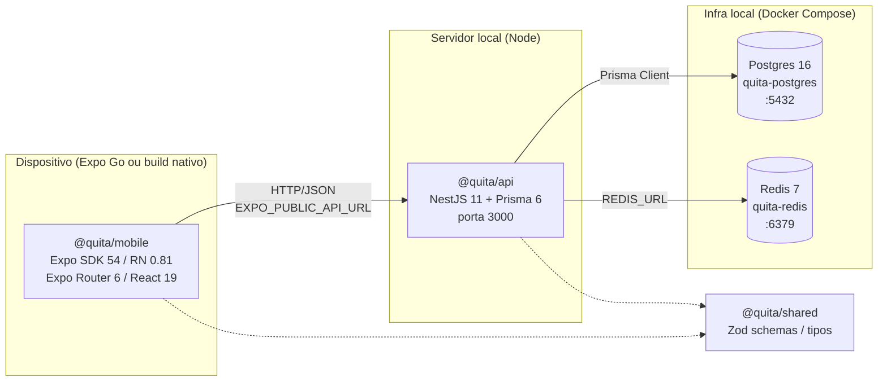

# Arquitetura do Monorepo Quita

Este documento descreve a estrutura geral do monorepo `quita`, a stack utilizada e como as peças se conectam. Para fluxo de execução local (scripts, portas, troubleshooting), ver [[02-dev-workflow]].

## Stack

### Toolchain do monorepo

- **Gerenciador de pacotes:** `pnpm@10.25.0` (definido em `package.json` via `packageManager`).
- **Node.js:** versão não fixada explicitamente em `engines`; inferida a partir dos requisitos do Expo SDK 54 e NestJS 11 — recomenda-se Node 20 LTS ou superior (verificar).
- **Orquestrador de tarefas:** [Turborepo](https://turbo.build) `^2.4.4` (`turbo.json` na raiz).
- **TypeScript:** `^5.7.3` na raiz, com versões alinhadas em cada workspace.
- **Lint/Format:** [Biome](https://biomejs.dev) `^1.9.4` (`biome.json`), com `indentStyle: tab` e `lineWidth: 100`.
- **Validação de schema:** [Zod](https://zod.dev) compartilhado entre API e mobile via `@quita/shared`.

### Backend (`apps/api`)

- **Framework:** [NestJS 11](https://nestjs.com) (`@nestjs/common`, `@nestjs/core`, `@nestjs/platform-express`).
- **Auth:** `@nestjs/jwt` `^11.0.2`, `@nestjs/passport` `^11.0.5`, `passport-jwt` `^4.0.1`, `bcryptjs` `^3.0.3`.
- **ORM:** [Prisma 6](https://www.prisma.io) (`@prisma/client` + `prisma` CLI `^6.0.0`).
- **Build/Run:** Nest CLI (`nest start --watch` em dev, `nest build` para produção). Saída em `dist/`, entrypoint `node dist/main`.
- **Validação:** Zod `^3.24.0`.
- **TS config:** `apps/api/tsconfig.json` estende `tooling/typescript/nestjs.json` e mapeia `@quita/shared` → `../../packages/shared/src` (path alias para dev).

### Mobile (`apps/mobile`)

- **Runtime:** [Expo](https://expo.dev) SDK `~54.0.34` com `newArchEnabled: true` (`apps/mobile/app.json`).
- **React Native:** `~0.81.5` sobre **React 19** (`^19.1.0`).
- **Navegação:** [Expo Router](https://docs.expo.dev/router/introduction/) `~6.0.23` (entrypoint `expo-router/entry`).
- **Estado/Dados:** [TanStack Query](https://tanstack.com/query) `^5.90.21`, [Zustand](https://zustand.docs.pmnd.rs) `^5.0.11`.
- **HTTP:** Axios `^1.13.6`.
- **Storage seguro:** `expo-secure-store` `~15.0.8`.
- **UI/Fontes:** `expo-linear-gradient`, `@expo-google-fonts/plus-jakarta-sans`, `@expo/vector-icons`.
- **Build/Bundler:** Metro com config monorepo-aware (ver [Resolução de dependências](#resolução-de-dependências)). Babel preset `babel-preset-expo`.
- **Plugins Expo registrados:** `expo-router`, `expo-secure-store`, `expo-font`, `@react-native-community/datetimepicker`.
- **App identifiers:** iOS `com.quita.app`, Android `com.quita.app`, scheme `quita`.

### Shared (`packages/shared`)

- Pacote interno `@quita/shared` (privado, `version: 0.0.1`).
- Builds para `dist/index.js` + `dist/index.d.ts` via `tsc`.
- Dependência única: Zod (`^3.24`). Hospeda schemas, enums, constantes, tipos e utilidades reutilizáveis entre API e mobile.

## Estrutura do monorepo

```
quita/
├── apps/
│   ├── api/         # @quita/api  — NestJS 11 + Prisma 6
│   └── mobile/      # @quita/mobile — Expo SDK 54 + RN 0.81 + Expo Router 6
├── packages/
│   └── shared/      # @quita/shared — Zod schemas, tipos, utils
├── tooling/
│   └── typescript/  # tsconfig bases (ex.: nestjs.json)
├── docs/
│   └── obsidian/    # esta documentação
├── biome.json
├── docker-compose.yml
├── package.json
├── pnpm-workspace.yaml
└── turbo.json
```

`pnpm-workspace.yaml` registra três globs: `apps/*`, `packages/*`, `tooling/*`.

### Responsabilidades

- **`apps/api`** — Servidor HTTP, regras de negócio, integração com Postgres (via Prisma) e Redis. Expõe a API consumida pelo mobile. Schema Prisma em `apps/api/prisma/`.
- **`apps/mobile`** — App Expo (iOS/Android) que consome a API HTTP. Usa Expo Router para navegação baseada em arquivos.
- **`packages/shared`** — Contrato compartilhado (DTOs/schemas Zod, enums, constantes) consumido por ambos via `workspace:*`.
- **`tooling/typescript`** — Bases de `tsconfig` reutilizáveis pelos workspaces.

## Resolução de dependências

O monorepo usa **pnpm workspaces** com hoisting controlado. O arquivo `.npmrc` na raiz define:

```ini
auto-install-peers=true
strict-peer-dependencies=false
public-hoist-pattern[]=*metro*
public-hoist-pattern[]=*expo*
public-hoist-pattern[]=react-native*
```

- `auto-install-peers=true` — pnpm instala peer deps automaticamente.
- `strict-peer-dependencies=false` — necessário para conviver com o ecossistema RN/Expo, que tem peer deps voláteis.
- `public-hoist-pattern[]` — eleva pacotes que casam com `*metro*`, `*expo*` e `react-native*` para o `node_modules` raiz, exigência do Metro/Expo CLI ao operar dentro de monorepo.

### Metro config (mobile)

`apps/mobile/metro.config.js` instrui o Metro a:

- Observar a raiz do monorepo (`config.watchFolders = [monorepoRoot]`).
- Resolver módulos a partir de `apps/mobile/node_modules` **e** do `node_modules` raiz (`config.resolver.nodeModulesPaths`).

Isso permite que o app importe `@quita/shared` sem etapas extras de bundling.

### Builds permitidos

`package.json` raiz lista `pnpm.onlyBuiltDependencies` com os pacotes autorizados a executar scripts de instalação:

- `@biomejs/biome`
- `@nestjs/core`
- `@prisma/client`
- `@prisma/engines`
- `prisma`

## Configurações chave

### `turbo.json`

| Task          | Cache | Persistente | dependsOn   | Outputs                               |
|---------------|-------|-------------|-------------|---------------------------------------|
| `build`       | sim   | não         | `^build`    | `dist/**`, `.next/**` (excl. cache)   |
| `dev`         | não   | sim         | —           | —                                     |
| `typecheck`   | sim   | não         | `^build`    | —                                     |
| `lint`        | sim   | não         | —           | —                                     |
| `clean`       | não   | não         | —           | —                                     |
| `db:generate` | não   | não         | —           | —                                     |
| `db:push`     | não   | não         | —           | —                                     |
| `db:migrate`  | não   | não         | —           | —                                     |
| `db:seed`     | não   | não         | —           | —                                     |
| `db:studio`   | não   | sim         | —           | —                                     |

`typecheck` depende de `^build` para garantir que o `@quita/shared` esteja compilado (`dist/`) antes da checagem nos consumidores.

### Biome (`biome.json`)

- Formatter habilitado, indent com tab, largura 100.
- Linter habilitado, regras `recommended`.
- `organizeImports` habilitado.
- Ignora: `node_modules`, `dist`, `.next`, `.expo`, `.turbo`, `.claude`, `prisma/migrations`.

### TS path alias `@quita/shared`

- No backend (`apps/api/tsconfig.json`), em dev, o path alias aponta para `../../packages/shared/src`.
- No build de produção, o consumo passa pelo `dist/` publicado dentro do workspace via `workspace:*`.
- Mobile usa o pacote diretamente como dependência `workspace:*`; o Metro resolve via `nodeModulesPaths`.

## Diagrama de alto nível



## Notas relacionadas

- [[02-dev-workflow]]
- [[03-api-overview]]
- [[04-mobile-overview]]
- [[05-shared-package]]
- [[06-prisma-schema]]
- [[07-auth]]
