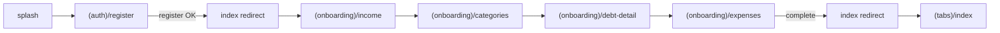
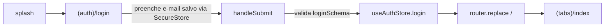

# 07 - Telas (Overview)

Mapa geral das telas do app Quita (Expo Router) e fluxos principais de navegação. Cada grupo de rotas vive em `apps/mobile/app/`.

> Stack root em [[01-arquitetura]] e roteador em `apps/mobile/app/_layout.tsx` (carrega fonts Plus Jakarta Sans, monta `<QueryProvider>` e dispara `useAuthStore.loadToken()` via `<AuthInit />`).

## Papel de cada group

- **(auth)** — Onboarding de identidade (entrar / cadastrar / recuperar senha). Quando o usuário não está autenticado, o `index.tsx` redireciona para `splash`, que oferece os atalhos para login/registro.
- **(onboarding)** — Captura de dados financeiros iniciais em 4 passos (renda, categorias, dívidas por categoria, despesas). Avança via `onboardingStep` no usuário e termina chamando `complete-onboarding`.
- **(tabs)** — App propriamente dito após login + onboarding finalizado. Tab bar customizada com 4 abas: Início, Finanças, Plano, Perfil. Layout em `apps/mobile/app/(tabs)/_layout.tsx`.
- **(modals)** — Folhas de fundo (`presentation: "modal"`) para criar/editar registros (nova receita, nova despesa, nova dívida, picker, pagar dívida) e estados especiais (confirmação, celebração, situação crítica, modo azul).

## Roteamento raiz

`apps/mobile/app/index.tsx` decide para onde mandar o usuário:

- `isLoading` → spinner.
- não autenticado → `/splash`.
- autenticado mas onboarding incompleto → onboarding no passo correto (`onboardingStep` 0/1/2 → income, ≥1 → categories, ≥3 → expenses).
- autenticado + completo → `(tabs)`.

## Happy-path: cadastro novo

## Login com "lembrar de mim"

O checkbox **Lembrar de mim** persiste `rememberedEmail` e `rememberMe` no `expo-secure-store`. Se desmarcado, limpa também o `accessToken`.

## Mapa de notas

- [[07a-telas-auth]] — splash, index raiz, login, register, forgot-password
- [[07b-telas-onboarding]] — income, categories, debt-detail, expenses
- [[07c-telas-tabs]] — Início (Hoje), Plano, layout das tabs
- [[07d-telas-financas]] — Finanças (lista mensal), detalhe da dívida, gráficos
- [[07e-telas-profile]] — Perfil, segurança, notificações, modo discreto, exportar dados
- [[07f-telas-modais]] — new-debt, new-expense, new-income, picker, pay-debt, payment-confirmed, celebration, critical, blue-mode

## Notas relacionadas

- [[01-arquitetura]]
- [[06-componentes]]
- [[09-shared]]
- [[04a-api-auth]]
- [[04b-api-onboarding]]
