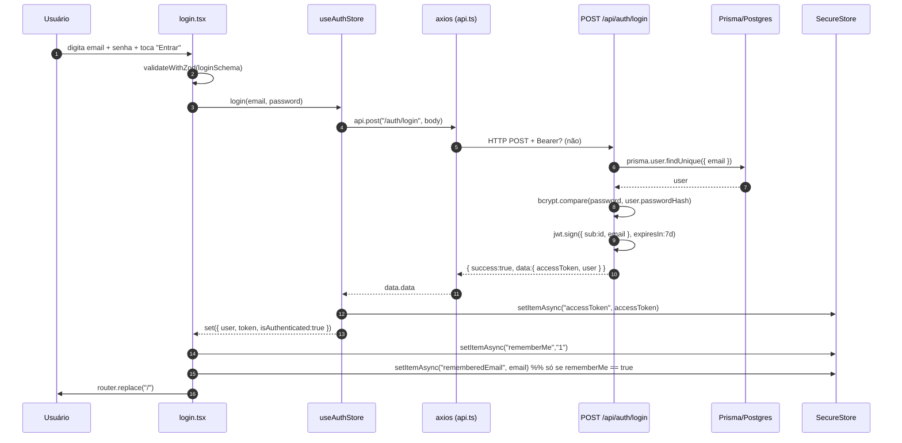

# 11 · Fluxo de autenticação

> Auth do Quita: e-mail + senha, JWT de 7 dias, persistência via `expo-secure-store`. Sem refresh token longo-prazo (ainda) — o `refresh` apenas renova um JWT já válido. Google login marcado "Em breve" nas telas.

## Stack

| Camada | Implementação |
| --- | --- |
| Backend | NestJS + `@nestjs/jwt` + `@nestjs/passport` + `passport-jwt` + `bcryptjs` |
| Schema validação | `loginSchema`, `registerSchema` em [[09-shared|@quita/shared]] |
| Mobile state | `zustand` em [apps/mobile/src/stores/auth.ts](../../apps/mobile/src/stores/auth.ts) |
| Persistência | `expo-secure-store` (Keychain iOS / Keystore Android) |

JWT config em [apps/api/src/modules/auth/auth.module.ts](../../apps/api/src/modules/auth/auth.module.ts):

```ts
JwtModule.register({
  secret: process.env.JWT_SECRET || "dev-secret-change-in-production",
  signOptions: { expiresIn: "7d" },
});
```

> 7 dias confirmado em código. Sem rotação de refresh token persistido — o endpoint `/auth/refresh` apenas re-emite um novo JWT a partir de um existente válido.

## Diagrama — Happy path do login



## Endpoints

Definidos em [apps/api/src/modules/auth/auth.controller.ts](../../apps/api/src/modules/auth/auth.controller.ts).

| Método | Rota | Guard | Body |
| --- | --- | --- | --- |
| POST | `/api/auth/register` | público | `registerSchema` |
| POST | `/api/auth/login` | público | `loginSchema` |
| POST | `/api/auth/refresh` | `JwtAuthGuard` | — (usa JWT do header) |
| GET | `/api/auth/me` | `JwtAuthGuard` | — |

## Register

### Payload

```json
{
  "name": "Maria Silva",
  "email": "maria@exemplo.com",
  "phone": "11999998888",
  "password": "********"
}
```

### Backend ([apps/api/src/modules/auth/auth.service.ts](../../apps/api/src/modules/auth/auth.service.ts))

1. `prisma.user.findUnique({ where: { email } })` — se existir → `ConflictException("Esse e-mail já está cadastrado.")` (409).
2. `bcrypt.hash(password, 10)`.
3. Cria `User` com `avatarInitials` derivado dos 2 primeiros nomes (uppercase).
4. `jwt.sign({ sub: user.id, email }, expiresIn:"7d")`.
5. Retorna `{ accessToken, user }` (sem `passwordHash`). Wrapper de envelope `{ success, data }` é aplicado pelo backend.

### Mobile (`useAuthStore.register`)

```ts
const { data } = await api.post("/auth/register", { name, email, phone, password });
const { user, accessToken } = data.data;
await SecureStore.setItemAsync("accessToken", accessToken);
set({ user, token: accessToken, isAuthenticated: true, isLoading: false });
```

UI ([apps/mobile/app/(auth)/register.tsx](../../apps/mobile/app/(auth)/register.tsx)):

- Aplica `maskPhone`/`unmaskPhone`, normaliza email (`trim().toLowerCase()`).
- 409 dispara Alert customizado **"Conta já existe"** com botão "Fazer login" → redireciona pra `/(auth)/login`. Demais erros caem em `Alert.alert("Erro ao criar conta", message)` (mensagem vinda de [[10-tratamento-erros|extractMessage]]).
- Sucesso → `router.replace("/")`.

## Login

### Payload

```json
{ "email": "maria@exemplo.com", "password": "********" }
```

### Backend

1. `findUnique({ email })` — não existe → `UnauthorizedException("E-mail ou senha incorretos.")`.
2. `bcrypt.compare(password, passwordHash)` — falso → mesma mensagem (não revela qual campo errou).
3. `jwt.sign(...)` 7 dias.
4. Retorna `{ accessToken, user }`.

### Mobile — Remember me

UI ([apps/mobile/app/(auth)/login.tsx](../../apps/mobile/app/(auth)/login.tsx)) usa duas chaves no `SecureStore`:

| Chave | Conteúdo |
| --- | --- |
| `rememberedEmail` | string com o e-mail (apenas se rememberMe ON) |
| `rememberMe` | `"1"` ou `"0"` |
| `accessToken` | JWT atual |

Comportamento:

- **Boot da tela**: carrega `rememberedEmail` e `rememberMe` em paralelo. Se `savedFlag !== null`, aplica ao state (`rememberMe = savedFlag === "1"`); default é `true`.
- **Submit**:
  1. Valida com `loginSchema`.
  2. Chama `useAuthStore.login(email, password)` — isso já grava o token em `SecureStore`.
  3. Persiste a flag: `SecureStore.setItemAsync("rememberMe", rememberMe ? "1" : "0")`.
  4. Se **rememberMe ON** → grava `rememberedEmail`.
  5. Se **rememberMe OFF** → deleta `rememberedEmail` **e** deleta `accessToken` ([apps/mobile/app/(auth)/login.tsx:75-78](../../apps/mobile/app/(auth)/login.tsx)). Resultado: a sessão funciona enquanto o app estiver aberto, mas no próximo `loadToken` não existirá token — usuário precisa logar de novo.

> Trade-off explícito: "Lembrar de mim" desligado **não** significa "deslogar agora", mas sim "não persistir entre sessões".

## Auto-login no boot

[apps/mobile/app/_layout.tsx](../../apps/mobile/app/_layout.tsx) renderiza um componente `AuthInit`:

```tsx
function AuthInit() {
  const loadToken = useAuthStore((s) => s.loadToken);
  useEffect(() => { loadToken(); }, [loadToken]);
  return null;
}
```

`useAuthStore.loadToken`:

1. `SecureStore.getItemAsync("accessToken")`.
2. Se existe → `GET /api/auth/me` (com Bearer injetado pelo request interceptor).
3. Sucesso → `set({ user, token, isAuthenticated: true, isLoading: false })`.
4. Falha (token expirado/inválido, 401) → `SecureStore.deleteItemAsync("accessToken")` + `set({ user:null, token:null, isAuthenticated:false, isLoading:false })`.
5. Sem token → apenas `set({ isLoading:false })`.

> O 401 em `/auth/me` cai no [interceptor de response](../../apps/mobile/src/services/api.ts) **e** no `try/catch` interno do `loadToken` — ambos limpam estado/storage de forma idempotente.

## Refresh

Endpoint `POST /api/auth/refresh` exige JWT válido (`JwtAuthGuard`). O service apenas re-emite um novo token a partir do `userId` do payload. Não há ainda chamada automática a esse endpoint pelo mobile — está exposto, mas não consumido.

## Logout

`useAuthStore.logout`:

```ts
await SecureStore.deleteItemAsync("accessToken");
set({ user: null, token: null, isAuthenticated: false });
```

> Não toca em `rememberedEmail` ou `rememberMe` — assim o e-mail fica pré-preenchido na próxima volta à tela de login se a flag estiver ON.

## Logout forçado em 401

Definido em [apps/mobile/src/services/api.ts](../../apps/mobile/src/services/api.ts):

```ts
const isAuthEndpoint = url.includes("/auth/login") || url.includes("/auth/register");
if (status === 401 && !isAuthEndpoint) {
  await SecureStore.deleteItemAsync("accessToken");
  useAuthStore.getState().logout();
}
```

- 401 em **qualquer endpoint protegido** (`/auth/me`, `/api/debts`, etc.) → derruba a sessão. O `RootLayout` reage automaticamente porque `isAuthenticated` está em estado.
- 401 em **`/auth/login` ou `/auth/register`** → preserva sessão e propaga o erro até a tela, que mostra Alert com a mensagem do backend.

## Tela esqueci-senha

[apps/mobile/app/(auth)/forgot-password.tsx](../../apps/mobile/app/(auth)/forgot-password.tsx). Valida com `forgotPasswordSchema` (apenas `contact: string.min(1)`). Hoje o handler termina em comentário `// TODO: call forgot password API` — ainda não há endpoint correspondente no backend.

## Notas relacionadas

- [[04-api-overview]]
- [[09-shared]]
- [[10-tratamento-erros]]
- [[12-fluxos-de-dados]]
- [[13-status-projeto]]
